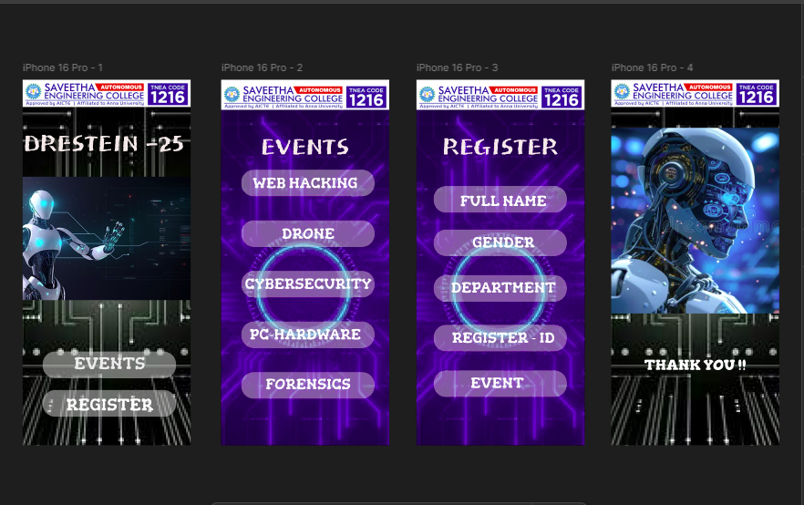

# Ex09 Event Registration Web Application
# Date: 25/11/2024
# AIM:
To design, develop and deploy a web application for event registration.

# DESIGN STEPS:
## Step 1:
Create a new frame.

## Step 2:
Select any one preset size of your choice.

## Step 3:
Select the shapes you need.

## Step 4:
Import images as needed.

## Step 5:
Create pages based on your need and link them.

## Step 6:
Validate the HTML and CSS code.

## Step 6:
Publish the website in the given URL.

# DESIGN TOOL:
Figma

# CODE:

# HOME PAGE:
    

    

    
    

        
        <h1 class="event-title">DRESTEIN -25</h1>
        
        <button class="events-button" tabindex="0">
        EVENTS
        </button>
        <button class="register-button" tabindex="0">
        REGISTER
        </button>
    

    

# EVENTS PAGE:

    

    

    
    

        
        
EVENTS

        

        WEB HACKING
         
        

        

        DRONE
         
        

        

        CYBERSECURITY
         
        

        

        PC-HARDWARE
         
        

        

        FORENSICS
         
        

    

    

# REGISTRATION PAGE:
    

    <form class="registration-container" role="form">
    
    

        
        <h1 class="form-title">REGISTER</h1>
        
        <label for="fullName" class="visually-hidden">Full Name</label>
        <input 
        type="text" 
        id="fullName" 
        class="form-field" 
        placeholder="FULL NAME"
        required
        />

        <label for="gender" class="visually-hidden">Gender</label>
        <select id="gender" class="form-field" required>
        <option value="">GENDER</option>
        <option value="male">Male</option>
        <option value="female">Female</option>
        <option value="other">Other</option>
        </select>

        <label for="department" class="visually-hidden">Department</label>
        <select id="department" class="form-field" required>
        <option value="">DEPARTMENT</option>
        </select>

        <label for="registerId" class="visually-hidden">Register ID</label>
        <input 
        type="text" 
        id="registerId" 
        class="form-field" 
        placeholder="REGISTER - ID"
        required
        />

        <label for="event" class="visually-hidden">Event</label>
        <select id="event" class="form-field" required>
        <option value="">EVENT</option>
        </select>
    

    </form>

# CONTACT PAGE:
    

    
    

        
        
        
THANK YOU !!

    

    

    
# OUTPUT:

# RESULT:
The program to design, develop and deploy a web application for event registration is completed successfully.
